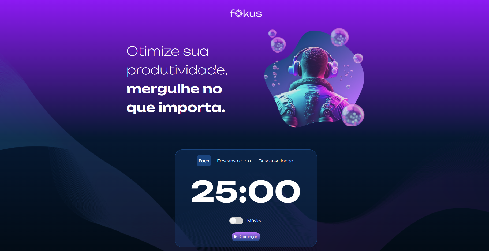

<h1 align="center"> Projeto Fokus </h1>

Projeto baseado na técnica  
<a href="https://pt.wikipedia.org/wiki/Técnica_pomodoro">Pomodoro</a>

    
    
    

  

## Tecnologias

Esse projeto foi desenvolvido com as seguintes tecnologias:

- HTML e CSS
- JavaScript
- Git e Github

## Link
<a href="https://gd0385.github.io/fokus/">fokus</a>